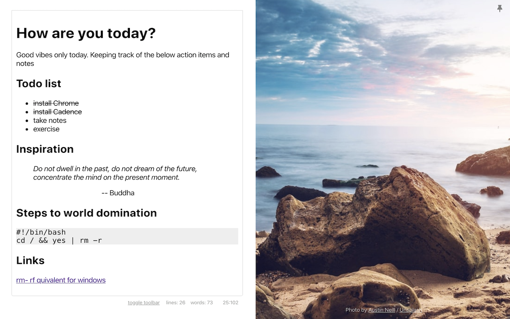

# Cadence



Minimal Chrome new tab markdown editor. Images from Unsplash. Inspired by [Moment](https://github.com/siebevd/Moment), by Siebe Van Dijck. 

Features:
* Uses a new React markdown editor (simplemde)
* New reactive UI features
* Query strings for Unsplash in settings
* Persistant view of the markdown editor changes

## Development

Firstly, sign up for an Unsplash API key and put it in `src/config.js` as following: 

```
module.exports = {
	unsplash: {
		apiKeys: ['<keys here>']
	}
}
```

You can also add multiple keys if you have them. Good for debugging and postponing the rate limiter. Ideally we'd have another service for that but yolo save dat $$$.

Start by using `yarn`. You can set up dev mode by using `yarn start`. Production builds are made using `yarn build`. You can then load the extension into Chrome by loading unpacked extension in the `build` directory.